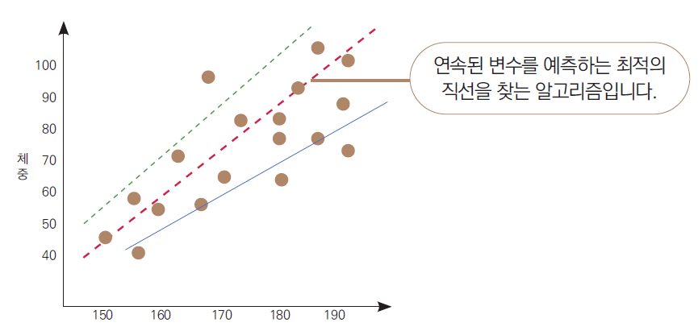
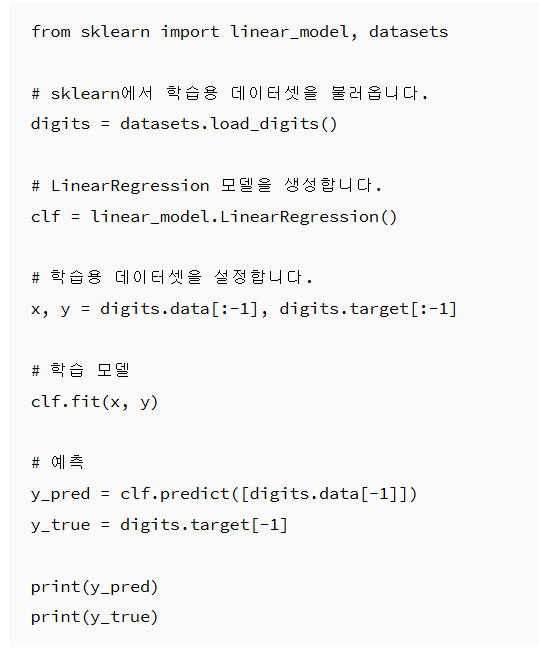

# 선형 회귀(Linear Regression)

선형 회귀는 가장 기초적인 머신러닝 모델입니다. 여러 가지 데이터를 활용하여 **연속형 변수인 목표 변수를 예측해 내는 것이 목적**입니다. 

예를 들어 몸무게, 나이, BMI, 성별 등을 데이터로 활용하여 키와 같은 연속형 변수를 예측하는 겁니다. 연속형 변수는 165.5cm, 172.3cm, 182.9cm와 같이 연속적으로 이어질 수 있는 변수를 의미합니다. 반면 남성/여성으로 구분되는 성별은 연속형 변수가 아닙니다. 선형 회귀 모델에서는 예측할 종속변수만 연속형 변수면 족합니다. 예측하는 데 사용되는 그외 변수들은 연속형일 필요는 없습니다.

- 구분 : 지도 학습
- 문제 유형 : 회귀
- 적합한 데이터 유형 : 종속변수와 독립변수가 선형 관계에 있는 데이터

복잡한 알고리즘에 비해서는 예측력이 떨어지지만 데이터 특성이 복잡하지 않을 때는 쉽고 빠른 예측이 가능하기 때문에 많이 사용됩니다. 다른 모델과의성능을 비교하는 베이스라인으로 사용하기도 합니다.

▼ 예시 그래프

▼ 장점

- 모델이 간단하기 때문에 구현과 해석이 쉽습니다.
- 같은 이유로 모델링하는 데 오랜 시간이 걸리지 않습니다.

▼ 단점

- 최신 알고리즘에 비해 예측력이 떨어집니다.
- 독립변수와 예측변수의 선형 관계를 전제로 하기 때문에, 이러한 전제에서 벗어나는 데이터에서는 좋은 예측을 보여주기 어렵습니다(선형 관계를 전제로 한다는 부분은 이 장의 마지막까지 보면 이해할 수 있습니다)

▼ 유용한 곳

- 연속된 변수를 예측하는 데 사용됩니다. 예를 들어 BMI(체질량지수), 매출액, 전력 사용량과 같은 변수를 떠올리시면 됩니다.

## 페이지 요약

- **개념**: 선형 회귀는 데이터를 활용하여 연속형 변수인 목표 변수를 예측하는 기초적인 머신러닝 모델입니다.
- **특성**: 지도 학습에 속하며 회귀 문제를 해결합니다. 종속변수와 독립변수가 선형 관계에 있는 데이터에 적합합니다.
- **장점**: 모델이 간단하여 구현과 해석이 쉽고, 모델링 시간이 짧습니다.
- **단점**: 최신 알고리즘보다 예측력이 떨어지며, 선형 관계를 전제로 하기 때문에 비선형 데이터에서는 성능이 좋지 않습니다.
- **활용**: BMI, 매출액, 전력 사용량과 같은 연속형 변수 예측에 사용됩니다. 복잡하지 않은 데이터에서 빠른 예측이 가능하며, 다른 모델과의 성능 비교를 위한 베이스라인으로도 활용됩니다.