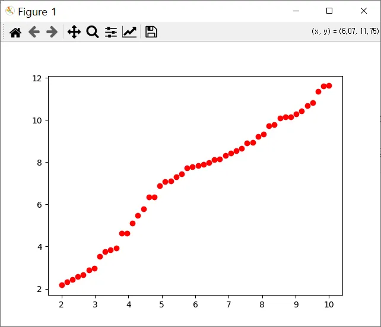
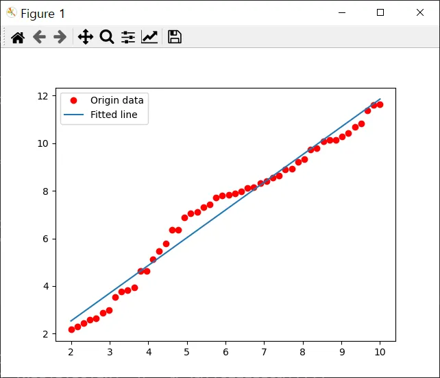
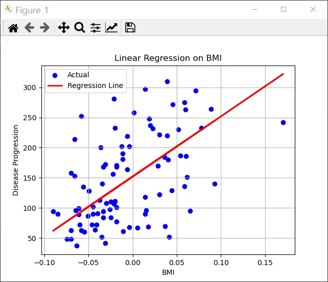

# 실습코드 - 1

https://junstar92.tistory.com/95 

```python
import tensorflow as tf
import numpy as np
 
X = np.linspace(2, 10, num=50)
Y = np.random.rand(50)*10 + 2
Y.sort()
print('X = ', X)
print('Y = ', Y)

import matplotlib.pyplot as plt
plt.plot(X, Y, 'ro')
plt.show()

W = tf.Variable(np.zeros(()), name='weight')
b = tf.Variable(np.zeros(()), name='bias')

def linear_regression(x):
    return W*x + b
 
def mean_square(y_pred, y):
    return tf.reduce_mean(tf.square(y_pred - y))

epochs = 1000
optimizer = tf.optimizers.SGD()
 
for epoch in range(1, epochs + 1):
    with tf.GradientTape() as t:
        pred = linear_regression(X)
        loss = mean_square(pred, Y)
    
    # compute gradients
    gradients = t.gradient(loss, [W, b])
 
    # update W and b following gradients
    optimizer.apply_gradients(zip(gradients, [W, b]))
 
    if epoch % 50 == 0:
        print(f'{epoch} epoch : loss = {loss}, W = {W.numpy()}, b = {b.numpy()}')

plt.plot(X, Y, 'ro', label='Origin data')
plt.plot(X, np.array(W*X + b), label='Fitted line')
plt.legend()

plt.show()
```

### ✅ 요약 설명

- **붉은 점** = 원래 데이터 (정답)
- **파란 선** = 모델이 학습을 통해 찾은 예측 직선

이 코드는

**2~10 사이의 숫자(X)**와 **랜덤하게 증가하는 값(Y)** 으로 구성된 **가상의 데이터**에 대해,

→ **선형회귀(직선)를 학습시켜**

→ `Y = WX + b` 형태의 **모델을 만들고**

→ 예측값이 원래 데이터와 잘 맞는지 **직선 그래프로 시각화**한 예제.

분류가 아니라 **회귀(regression)** 문제.

즉, 값을 예측하는 문제.

- 잘 예측된 경우.





---

# 실습코드 - 2 

**필요한 라이브러리**

pip install matplotlib scikit-learn pandas

```python
# 1. 라이브러리 불러오기
import matplotlib.pyplot as plt
import pandas as pd
from sklearn.datasets import load_diabetes
from sklearn.linear_model import LinearRegression
from sklearn.model_selection import train_test_split
from sklearn.metrics import mean_squared_error, r2_score

# 2. 데이터 불러오기
diabetes = load_diabetes()
X = pd.DataFrame(diabetes.data, columns=diabetes.feature_names)
y = diabetes.target

# 3. 특정 특성만 사용해서 단순 선형 회귀 (예: 'bmi')
X_bmi = X[['bmi']]  # body mass index

# 4. 데이터 분할
X_train, X_test, y_train, y_test = train_test_split(X_bmi, y, test_size=0.2, random_state=42)

# 5. 모델 학습
model = LinearRegression()
model.fit(X_train, y_train)

# 6. 예측
y_pred = model.predict(X_test)

# 7. 성능 평가
print("Mean Squared Error (MSE):", mean_squared_error(y_test, y_pred))
print("R2 Score:", r2_score(y_test, y_pred))

# 8. 회귀선 시각화
plt.scatter(X_test, y_test, color='blue', label='Actual')
plt.plot(X_test, y_pred, color='red', linewidth=2, label='Regression Line')
plt.xlabel('BMI')
plt.ylabel('Disease Progression')
plt.title('Linear Regression on BMI')
plt.legend()
plt.grid(True)
plt.show()

```

### 🎯 목적:

- "사람의 BMI(체질량지수)를 보고, 당뇨병 진행 정도를 예측할 수 있을까?"

### 🎯 코드 요약

- 머신러닝의 기본 구조 (데이터 → 학습 → 예측 → 평가)

### 🎯 결과 요약



### 🔵 파란 점들 (Actual)

- `X`: 환자의 **BMI (체질량지수)**
- `Y`: 당뇨병 **질병 진행 정도 (Disease Progression)**
- 이 점들은 실제 데이터셋(`load_diabetes()`)에서 나온 **실제 관측값들**입니다.

### 🔴 빨간 선 (Regression Line)

- **선형 회귀 모델**이 학습을 통해 찾아낸 직선입니다.
- 수식 형태는 `y = Wx + b` (BMI가 높아질수록 예측되는 질병 진행 정도도 증가)

---

## ✅ 결과 요약

- **목표**: BMI(체질량지수)만 가지고 당뇨병 진행 정도를 예측할 수 있는지 확인
- **결과 해석**:
    - 빨간 선은 데이터의 **전반적인 경향(추세선)** 을 보여줍니다.
    - 파란 점들이 선에 가까울수록, 모델이 예측을 잘한 것입니다.
    - 점들이 흩어져 있는 정도(산포)를 보면, BMI 하나만으로는 정확한 예측은 어렵지만 **어느 정도 경향성은 있음**을 보여줍니다.
    - 잘 예측되지 않은 경우.