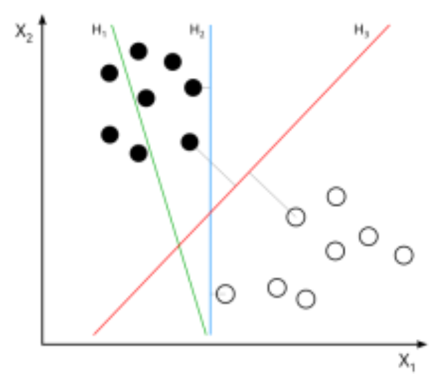
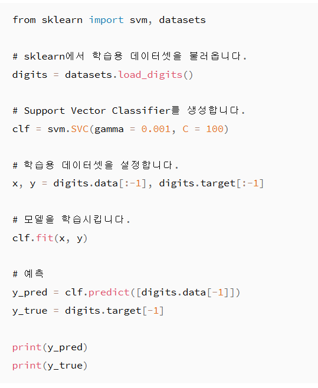

# SVM(Support Vector Machine)

SVM은 분류 알고리즘의 한 종류입니다. SVM은 각 데이터의 점들을 선을 사용해서 구분하며, 이 선은 데이터의 범주를 구분시킬 수 있는 가장 가까운 2개의 데이터의 점을 기준으로 만들어집니다.

이 그래프에서는 빨간 선(H₃)이 가장 가까운 데이터의 점이 알맞은 거리에 있기 때문에 두 개의 범주를 구분짓는 가장 확실한 선이라고 할 수 있습니다.

## ✅ SVM 핵심 개념 요약

| 항목 | 설명 |
| --- | --- |
| **목표** | 클래스 간의 **최적의 경계선(초평면, Hyperplane)** 을 찾는 것 |
| **핵심 아이디어** | 두 클래스를 가장 **잘 분리할 수 있는 선(또는 면)** 을 찾고, 이 선과 가장 가까운 데이터 포인트(서포트 벡터)까지의 **거리를 최대화(Margin 최대화)** |
| **서포트 벡터** | 결정 경계에 가장 가까이 있는 데이터 포인트들 |
| **초평면(Hyperplane)** | 데이터를 분류하는 기준선 (2D에서는 선, 3D에서는 평면) |
| **마진(Margin)** | 초평면과 서포트 벡터 간의 거리. 이 마진이 클수록 일반화 성능이 높음 |

---

## 🎯 작동 방식

1. **이진 분류 기준**
    
    클래스 A와 클래스 B를 나누는 가장 넓은 간격의 선(= 결정 경계)을 찾음
    
    → 그 선은 마진을 최대화하면서 두 클래스를 분리함
    
2. **서포트 벡터**
    
    마진을 결정하는 결정적인 데이터 포인트들 → 이 포인트들만 알고 있으면 결정 경계를 정의할 수 있음
    
3. **비선형 분류 문제는?**
    - 선형으로 나눌 수 없는 경우, 데이터를 고차원으로 매핑하여 선형 분리가 가능하도록 함
    - 이때 사용되는 것이 **커널 트릭(Kernel Trick)**

---

## 🔄 커널 함수 종류 (비선형 문제 해결)

| 커널 함수 | 설명 |
| --- | --- |
| 선형 커널 | `K(x, y) = x · y` — 선형 분류 문제에 사용 |
| 다항 커널 | `K(x, y) = (x · y + 1)^d` — 비선형 곡선을 그릴 수 있음 |
| RBF (가우시안) 커널 | `K(x, y) = exp(-γ |
| Sigmoid 커널 | `K(x, y) = tanh(α x · y + c)` — 신경망과 유사한 형태 |

---

## ⚙️ 주요 하이퍼파라미터
| 파라미터 | 설명 |
| --- | --- |
| `C` | 마진 크기 vs 분류 오류 허용의 균형 조절. 작으면 마진을 크게, 크면 오류를 줄이는 데 집중 |
| `gamma` | RBF 커널에서의 영향력 범위. 크면 근처 포인트만 고려, 작으면 멀리까지 영향 |
| `kernel` | 사용할 커널 함수 종류 선택 (예: `'linear'`, `'rbf'`, `'poly'` 등) |

