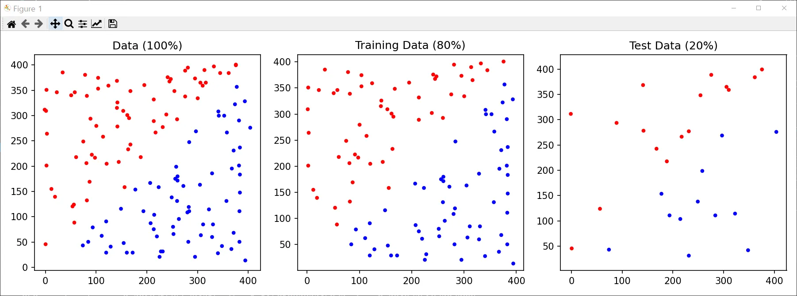
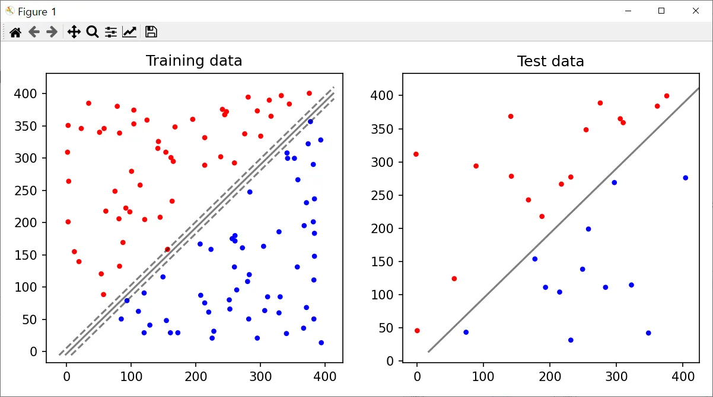
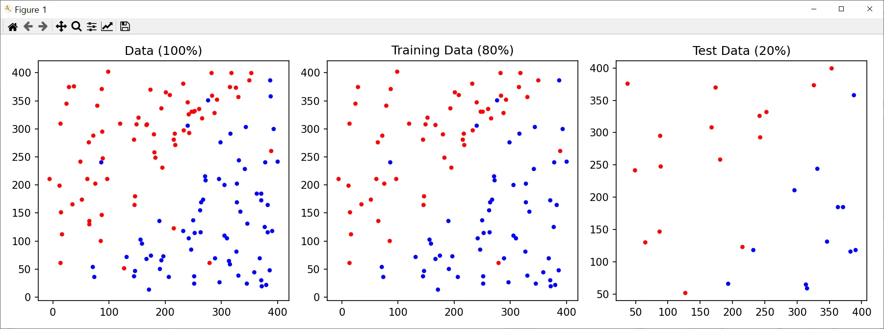
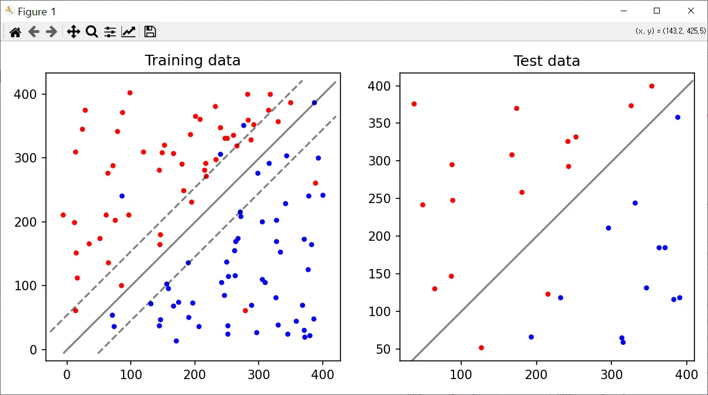
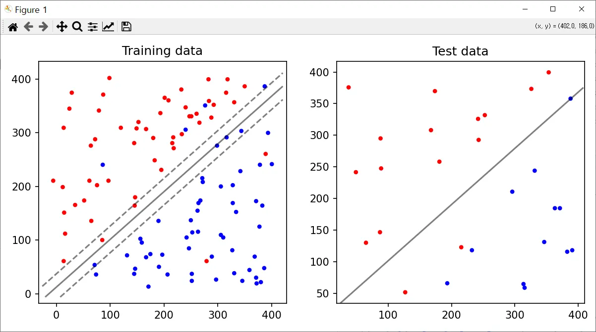
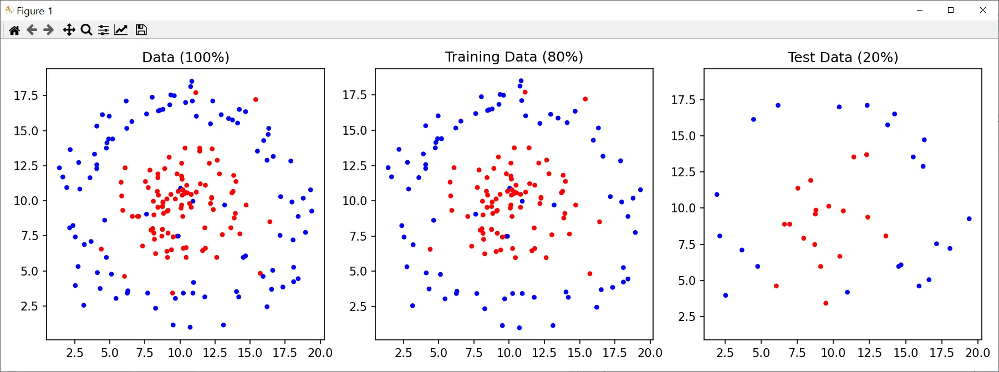
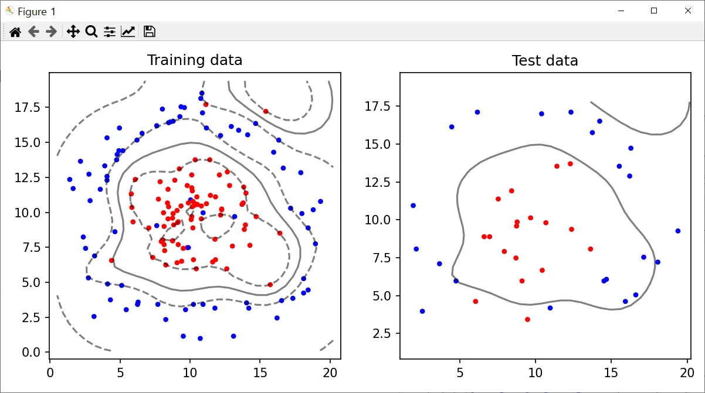
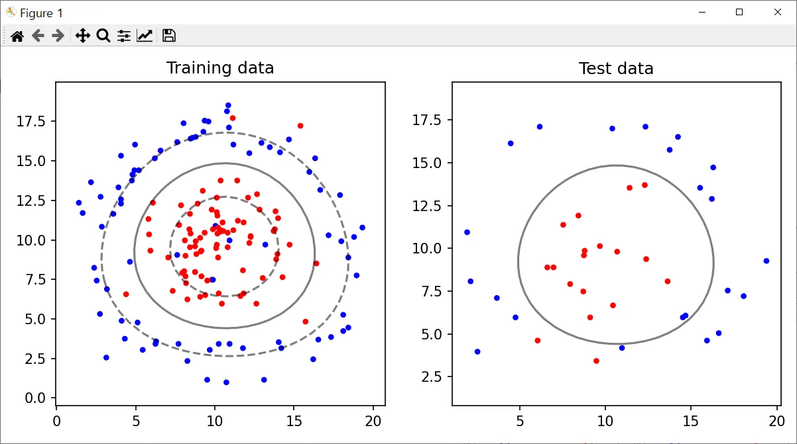
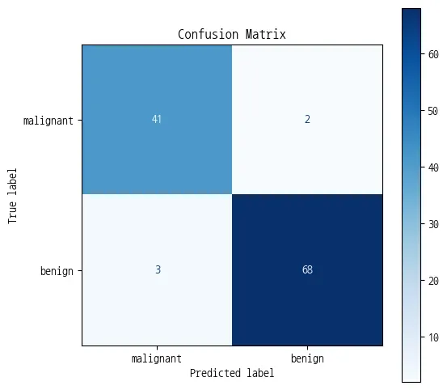

# 실습코드 - 1

▶ 자체 데이터셋 사용, 설명 링크

https://bkshin.tistory.com/entry/%EB%A8%B8%EC%8B%A0%EB%9F%AC%EB%8B%9D-3%EC%84%9C%ED%8F%AC%ED%8A%B8-%EB%B2%A1%ED%84%B0-%EB%A8%B8%EC%8B%A0-SVM-%EC%8B%A4%EC%8A%B5

▶ 코드 링크

https://github.com/BaekKyunShin/Intro-to-Machine-Learning/tree/master/SVM

> SVM_DATA.zip 참조

```python
import sys
import os
import matplotlib.pyplot as plt
import pandas as pd
import numpy as np
from sklearn import svm
from sklearn.model_selection import train_test_split, GridSearchCV
# from utils import read_data, plot_data, plot_decision_function

red_RGB = (1, 0, 0)
blue_RGB = (0, 0, 1)
data_colors = [red_RGB, blue_RGB]

def read_points_file(filename):
    points = []
    with open(filename, "r") as f:
        for point in f:
            point = point.strip("\n").split()
            points.append([float(point[0]), float(point[1])])
    return points

def read_data(class_0_file, class_1_file):
    points_label0 = read_points_file(class_0_file)
    points_label1 = read_points_file(class_1_file)
    points = points_label0 + points_label1
    points = np.array(points)
    
    label0, label1 = [0], [1]
    num_of_label0, num_of_label1 = len(points_label0), len(points_label1)
    labels = label0 * num_of_label0 + label1 * num_of_label1
    
    return (points, labels)

def plot_data(X_train, y_train, X_test, y_test):
  
    X = np.concatenate((X_train, X_test))
    y = np.concatenate((y_train, y_test))

    colors = get_colors(y)
    colors_train = get_colors(y_train)
    colors_test = get_colors(y_test)

    plt.figure(figsize=(12, 4), dpi=150)

    # Plot all data plot
    plt.subplot(131)
    plt.axis('equal')
    plt.scatter(X[:, 0], X[:, 1], c=colors, s=10, edgecolors=colors)
    plt.title("Data (100%)")

    # training data plot
    plt.subplot(132)
    plt.axis('equal')
    #plt.axis('off')
    plt.scatter(X_train[:, 0], X_train[:, 1], c = colors_train, s = 10, edgecolors=colors_train)
    plt.title("Training Data (80%)")

    # testing data plot
    plt.subplot(133)
    plt.axis('equal')
    #plt.axis('off')
    plt.scatter(X_test[:, 0], X_test[:, 1], c = colors_test, s = 10, edgecolors=colors_test)
    plt.title("Test Data (20%)")
    plt.tight_layout()
    plt.show()

def get_colors(y):
    return [data_colors[label] for label in y]

def plot_decision_function(X_train, y_train, X_test, y_test, clf):
    plt.figure(figsize=(8, 4), dpi=150)
    plt.subplot(121)
    plt.title("Training data")
    plot_decision_function_helper(X_train, y_train, clf)
    plt.subplot(122)
    plt.title("Test data")
    plot_decision_function_helper(X_test, y_test, clf, True)
    plt.show()

def plot_decision_function_helper(X, y, clf, show_only_decision_function = False):

    colors = get_colors(y)
    plt.axis('equal')
    plt.tight_layout()
    #plt.axis('off')

    plt.scatter(X[:, 0], X[:, 1], c=colors, s=10, edgecolors=colors)
    ax = plt.gca()
    xlim = ax.get_xlim()
    ylim = ax.get_ylim()

    # Create grid to evaluate model
    xx = np.linspace(xlim[0], xlim[1], 30)
    yy = np.linspace(ylim[0], ylim[1], 30)
    YY, XX = np.meshgrid(yy, xx)
    xy = np.vstack([XX.ravel(), YY.ravel()]).T # xy.shape = (900, 2)
    Z = clf.decision_function(xy).reshape(XX.shape)
    # clf.decision_function(xy).shape = (900,)
    # Z.shape = (30, 30)

    if  show_only_decision_function:
    # Plot decision boundary
        ax.contour(XX, YY, Z, colors='k', levels=[0], alpha=0.5,
                 linestyles=['-'])
    else :
    # Plot decision boundary and margins
        ax.contour(XX, YY, Z, colors='k', levels=[-1, 0, 1], alpha=0.5,
                 linestyles=['--', '-', '--'])
    # Plot support vectors
    #ax.scatter(clf.support_vectors_[:, 0], clf.support_vectors_[:, 1], s = 10,
    #         linewidth=1, facecolors='k', c = 'k', label='Support Vectors')

    #plt.legend(fontsize='small')

# Read data
x, labels = read_data("points_class_0.txt", "points_class_1.txt")

# Split data to train and test on 80-20 ratio
X_train, X_test, y_train, y_test = train_test_split(x, labels, test_size = 0.2, random_state=0)

print("Displaying data. Close window to continue.")
# Plot data
plot_data(X_train, y_train, X_test, y_test)

# make a classifier and fit on training data
clf = svm.SVC(kernel='linear')

# Train classifier 
clf.fit(X_train, y_train)

print("Displaying decision function. Close window to continue.")  
# Plot decision function on training and test data
plot_decision_function(X_train, y_train, X_test, y_test, clf)

# Make predictions on unseen test data
clf_predictions = clf.predict(X_test)
print("Accuracy: {}%".format(clf.score(X_test, y_test) * 100 ))

# Read data
x, labels = read_data("points_class_0_noise.txt", "points_class_1_noise.txt")

# Split data to train and test on 80-20 ratio
X_train, X_test, y_train, y_test = train_test_split(x, labels, test_size = 0.2, random_state=0)

print("Displaying data. Close window to continue.")
# Plot data
plot_data(X_train, y_train, X_test, y_test)

# make a classifier and fit on training data
clf_1 = svm.SVC(kernel='linear', C=1)
clf_1.fit(X_train, y_train)

print("Display decision function (C=1) ...\nThe SVM classifier will choose a large margin decision boundary at the expense of larger number of misclassifications")
# Plot decision function on training and test data
plot_decision_function(X_train, y_train, X_test, y_test, clf_1)

# make a classifier and fit on training data
clf_100 = svm.SVC(kernel='linear', C=100)
clf_100.fit(X_train, y_train)

print("Accuracy(C=1): {}%".format(clf_1.score(X_test, y_test) * 100 ))
print("\n")
print("Display decision function (C=100) ...\nThe classifier will choose a low margin decision boundary and try to minimize the misclassifications")
# Plot decision function on training and test data
plot_decision_function(X_train, y_train, X_test, y_test, clf_100)

print("Accuracy(C=100): {}%".format(clf_100.score(X_test, y_test) * 100 ))

# Make predictions on unseen test data
clf_1_predictions = clf_1.predict(X_test)
clf_100_predictions = clf_100.predict(X_test)

# Read data
x, labels = read_data("points_class_0_nonLinear.txt", "points_class_1_nonLinear.txt")

# Split data to train and test on 80-20 ratio
X_train, X_test, y_train, y_test = train_test_split(x, labels, test_size = 0.2, random_state=0)

print("Displaying data.")
# Plot data 
plot_data(X_train, y_train, X_test, y_test)

print("Training SVM ...")
# make a classifier
clf = svm.SVC(C = 10.0, kernel='rbf', gamma=0.1)

# Train classifier
clf.fit(X_train, y_train)

# Make predictions on unseen test data
clf_predictions = clf.predict(X_test)

print("Displaying decision function.")
# Plot decision function on training and test data
plot_decision_function(X_train, y_train, X_test, y_test, clf)

# Grid Search
print("Performing grid search ... ")

# Parameter Grid
param_grid = {'C': [0.1, 1, 10, 100], 'gamma': [1, 0.1, 0.01, 0.001, 0.00001, 10]}

# Make grid search classifier
clf_grid = GridSearchCV(svm.SVC(), param_grid, verbose=1)

# Train the classifier
clf_grid.fit(X_train, y_train)

# clf = grid.best_estimator_()
print("Best Parameters:\n", clf_grid.best_params_)
print("Best Estimators:\n", clf_grid.best_estimator_)

print("Displaying decision function for best estimator.")
# Plot decision function on training and test data
plot_decision_function(X_train, y_train, X_test, y_test, clf_grid)
```

- **결과 설명**

https://bkshin.tistory.com/entry/%EB%A8%B8%EC%8B%A0%EB%9F%AC%EB%8B%9D-3%EC%84%9C%ED%8F%AC%ED%8A%B8-%EB%B2%A1%ED%84%B0-%EB%A8%B8%EC%8B%A0-SVM-%EC%8B%A4%EC%8A%B5











# 실습문제 - 2

📦 필요한 라이브러리 
pip install scikit-learn matplotlib

📦 유방암 데이터 분류 문제 
# 1. 라이브러리 불러오기
import numpy as np
import matplotlib.pyplot as plt
from sklearn.datasets import load_breast_cancer
from sklearn.model_selection import train_test_split
from sklearn.preprocessing import StandardScaler
from sklearn.svm import SVC
from sklearn.metrics import classification_report, confusion_matrix, ConfusionMatrixDisplay

# 2. 데이터 불러오기
data = load_breast_cancer()
X = data.data
y = data.target
print("Target labels:", data.target_names)  # ['malignant' 'benign']

# 데이터 확인을 위해 추가
print("\n--- 데이터 샘플 확인 ---")
print("특성 데이터 (X) 상위 5개:\n", X[:5])
print("타겟 데이터 (y) 상위 5개:\n", y[:5])
print("특성 이름:\n", data.feature_names)

# 3. 데이터 전처리 (스케일링)
scaler = StandardScaler()
X_scaled = scaler.fit_transform(X)

# 4. 훈련/테스트 분할
X_train, X_test, y_train, y_test = train_test_split(X_scaled, y, test_size=0.2, random_state=42)

# 5. SVM 모델 학습
svm = SVC(kernel='linear', C=1.0)  # 선형 커널 SVM
svm.fit(X_train, y_train)

# 6. 예측
y_pred = svm.predict(X_test)

# 7. 평가 결과 출력
print("\nConfusion Matrix:\n", confusion_matrix(y_test, y_pred))
print("\nClassification Report:\n", classification_report(y_test, y_pred))

# 8. Confusion Matrix 시각화
plt.rcParams['font.family'] = 'NanumGothicCoding' # 한글 폰트 설정 (이전에 설치된 폰트 사용)
plt.rcParams['axes.unicode_minus'] = False # 마이너스 기호 깨짐 방지

fig, ax = plt.subplots(figsize=(6, 6))
display = ConfusionMatrixDisplay(confusion_matrix=confusion_matrix(y_test, y_pred),
                                 display_labels=data.target_names)
display.plot(cmap=plt.cm.Blues, ax=ax)
ax.set_title('Confusion Matrix')
plt.show()
​
결과
Target labels: ['malignant' 'benign']
Confusion Matrix:
[[39  3]
[ 1 71]]
Classification Report:
                             precision    recall       f1-score   support
malignant       0.97      0.93      0.95        42
   benign       0.96      0.99      0.97        72

​
       예측: 악성   예측: 양성
실제 악성     39           3
실제 양성      1          71

| 항목 | 설명 |
| --- | --- |
| **Precision (정밀도)** | 모델이 **양성이라고 예측한 것 중 실제로 양성인 비율** |
| **Recall (재현율)** | 실제 양성 중에서 모델이 **정확히 예측한 비율** |
| **F1-score** | 정밀도와 재현율의 **조화 평균** (균형 측정) |
| **Support** | 각 클래스에 속한 **실제 데이터 개수** |

