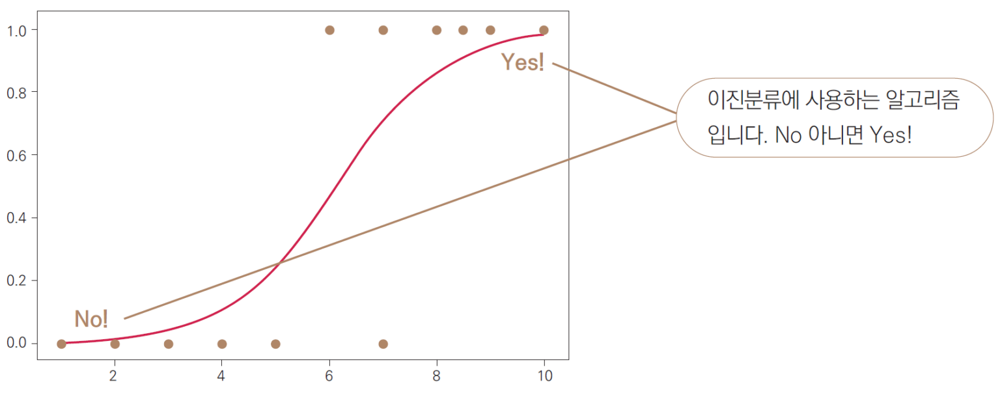

# 로지스틱 회귀(Logistic Regression)

로지스틱 회귀 또한 선형 회귀처럼 기본 분석 모델입니다. 로지스틱 회귀 분석은 알고리즘의 근간을 선형 회귀 분석에 두고 있어서 선형 회귀 분석과 상당히 유사하지만 다루는 문제가 다릅니다. 

선형 회귀 분석은 연속된 변수를 예측하는 반면, **로지스틱 회귀 분석은 Yes/No처럼 두 가지로 나뉘는 분류 문제**를 다룹니다.

- 구분 : 지도 학습
- 문제 유형 : 분류
- 적합한 데이터 유형 : 종속변수와 독립변수가 선형 관계에 있는 데이터

선형 회귀 분석과 마찬가지로, 너무나도 기본 알고리즘이라서 꼭 알고 있어야 합니다. 실제 이진분류가 필요한 상황이 많기 때문에 두 가지 범주를 구분하는 간단한 예측에 유용하며 딥러닝에서도 기본 지식입니다.

| 항목 | 설명 |
| --- | --- |
| 목적 | 입력 데이터를 **두 가지 클래스 중 하나로 분류** (예: 스팸/정상, 질병/정상 등) |
| 출력 | 0~1 사이의 **확률값** |
| 결정 기준 | 확률이 **0.5 이상이면 1**, 미만이면 **0** 으로 분류 |
| 사용 함수 | **시그모이드 함수(sigmoid)** 를 사용해 확률로 변환 |

▼ 예시 그래프

▼ 장점

- 선형 회귀 분석만큼 구현하기 용이합니다.
- 계수(기울기)를 사용해 각 변수의 중요성을 쉽게 파악할 수 있습니다.

▼ 단점

- 선형 회귀 분석을 근간으로 하고 있기 때문에, 선형 관계가 아닌 데이터에 대한 예측력이 떨어집니다.

▼ 유용한 곳

- Yes/No, True/False와 같은 두 가지 범주로 나뉜 값을 예측하는 데 사용합니다.
- 분류 문제에 있어서 기준선Baseline으로 자주 활용됩니다(타 모델과 비교 목적).

## 페이지 요약

- 로지스틱 회귀는 선형 회귀와 유사하지만, 연속 변수 예측이 아닌 이진 분류 문제를 다룹니다.
- 지도 학습에 속하며 분류 문제에 적합하고, 종속변수와 독립변수가 선형 관계에 있는 데이터에 적합합니다.
- 장점: 구현이 용이하고 변수의 중요성을 쉽게 파악할 수 있습니다.
- 단점: 선형 관계가 아닌 데이터에 대한 예측력이 떨어집니다.
- 주로 Yes/No, True/False와 같은 두 가지 범주 예측에 사용되며, 분류 문제의 기준선으로 활용됩니다.