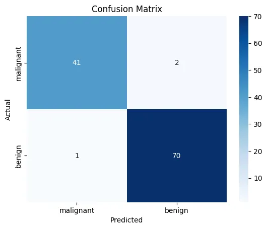

# 실습코드 - 1

▶ IRIS 데이터셋 사용
https://junstar92.tistory.com/96

```py
import sklearn.datasets
import tensorflow as tf
import numpy as np
import pandas as pd
import matplotlib.pyplot as plt

iris_data = sklearn.datasets.load_iris()
 
dataset = pd.DataFrame(data=np.c_[iris_data['data'], iris_data['target']], columns=iris_data['feature_names']+['target']).astype('float32')
print(dataset.head())
print(iris_data['target_names'])
print(dataset.describe())

dataset = dataset.sample(frac=1).reset_index(drop=True)
print(dataset.head())

m_train = 100
m_test = 50
num_features = 4
num_classes = 3
 
x_train = dataset.iloc[:m_train, :num_features]
y_train = dataset.iloc[:m_train, num_features]
x_test = dataset.iloc[m_train:, :num_features]
y_test = dataset.iloc[m_train:, num_features]
 
print(f'x_train shape : {x_train.shape}') # (100, 4)
print(f'y_train shape : {y_train.shape}') # (100, )
print(f'x_test shape : {x_test.shape}')   # (50, 4)
print(f'y_test shape : {y_test.shape}')   # (50, )

# 평균 and 표준편차 계산
mean = x_train.mean()
std = x_train.std()

# normalization
x_train = (x_train - mean) / std
x_test = (x_test - mean) / std
 
print(x_train.describe())


#학습
def logistic_regression(X, W, b):
    return tf.math.sigmoid(tf.matmul(X, W) + b)
 
def compute_cost(y_hat, y):
    y_orig = tf.one_hot(y, num_classes)
    cost = -tf.reduce_mean(tf.reduce_sum(y_orig*tf.math.log(y_hat) + (1-y_orig)*tf.math.log(1-y_hat), 1))
 
    return cost
 
def predict(y_hat):
    return tf.argmax(y_hat, 1)
 
def accuracy(y_pred, y):
    correct_pred = tf.equal(y_pred, tf.cast(y, tf.int64))
    return tf.reduce_mean(tf.cast(correct_pred, tf.float32))


def model(X_train, Y_train, X_test, Y_test, num_iteration=2000, learning_rate=0.01, opt='SGD'):
    # parameter initialization
    W = tf.Variable(tf.zeros([num_features, num_classes]), name='weight')
    b = tf.Variable(tf.zeros([num_classes]), name='bias')
    
    # select optimization algorithm
    if opt == 'SGD':
        optimizer = tf.optimizers.SGD(learning_rate=learning_rate)
    elif opt == 'Adam':
        optimizer = tf.optimizers.Adam(learning_rate=learning_rate)
    
    costs = []
    accs = []
 
    for iter in range(1, num_iteration + 1):
        with tf.GradientTape() as tape:
            y_hat = logistic_regression(X_train,W, b)
            cost = compute_cost(y_hat, Y_train)
        
        # compute gradient
        grads = tape.gradient(cost, [W, b])
 
        # update gradient
        optimizer.apply_gradients(zip(grads, [W, b]))
 
        # predict 
        pred = predict(y_hat)
        # compute accuracy
        acc = accuracy(pred, Y_train)
 
        # save status
        costs.append(cost)
        accs.append(acc)
 
        # print status
        if iter % 100 == 0:
            print(f'{iter} iterations : cost = {cost}, acc = {acc*100} %')
    
    # predict on test data
    y_pred = predict(logistic_regression(X_test, W, b))
    test_acc = accuracy(y_pred, Y_test)
 
    print(f'acc on test data : {test_acc*100} %')
 
    ret = {
        'weight':W,
        'bias':b,
        'costs':costs,
        'accs':accs
    }
 
    return ret

# SGD, iteration = 5000, learning_rate = 0.01
# opt1 = model(x_train, y_train, x_test, y_test, num_iteration=5000, learning_rate=0.01, opt='SGD')

# Adam, iteration = 5000, learning_rate = 0.01
opt2 = model(x_train, y_train, x_test, y_test, num_iteration=5000, learning_rate=0.01, opt='Adam')
```

# 실습문제 - 2

### 📦 유방암 진단 예제

📦 필요한 라이브러리

pip install scikit-learn matplotlib

📦 코드

```python
# 1. 라이브러리 불러오기
import numpy as np
import matplotlib.pyplot as plt
from sklearn.datasets import load_breast_cancer
from sklearn.linear_model import LogisticRegression
from sklearn.model_selection import train_test_split
from sklearn.preprocessing import StandardScaler
from sklearn.metrics import confusion_matrix, classification_report, accuracy_score
import pandas as pd
import seaborn as sns
import matplotlib.pyplot as plt

# 2. 데이터 로드
data = load_breast_cancer()
print(data.feature_names)

df = pd.DataFrame(data.data, columns=data.feature_names)
df['target'] = data.target
print(df.head())

sns.countplot(x=data.target, palette="Set2")
plt.xticks([0, 1], data.target_names)
plt.title("Target Distribution")
plt.show()

X = data.data
y = data.target
print("Target classes:", data.target_names)  # ['malignant' 'benign']

# 3. 데이터 스케일링 (정규화)
scaler = StandardScaler()
X_scaled = scaler.fit_transform(X)

# 4. 훈련/테스트 데이터 분할
X_train, X_test, y_train, y_test = train_test_split(X_scaled, y, test_size=0.2, random_state=42)

# 5. 로지스틱 회귀 모델 정의 및 학습
model = LogisticRegression(max_iter=10000)
model.fit(X_train, y_train)

# 6. 예측
y_pred = model.predict(X_test)

# 7. 평가 출력
print("Accuracy:", accuracy_score(y_test, y_pred))
cm = confusion_matrix(y_test, y_pred)
print("Confusion Matrix:\n", cm)
sns.heatmap(cm, annot=True, fmt="d", cmap="Blues", xticklabels=data.target_names, yticklabels=data.target_names)
plt.xlabel("Predicted")
plt.ylabel("Actual")
plt.title("Confusion Matrix")
plt.show()
print("Classification Report:\n", classification_report(y_test, y_pred))
```

✅ 결과 예시
```
Accuracy: 0.96
Confusion Matrix:
[[41  1]
[ 2 70]]
```


Classification Report:
                precision    recall  f1-score   support

malignant       0.95      0.98      0.96        42
benign            0.99      0.97      0.98        72

|  | 예측: 악성 (0) | 예측: 양성 (1) |
| --- | --- | --- |
| **실제: 악성 (0)** | 41 | 1 |
| **실제: 양성 (1)** | 2 | 70 |